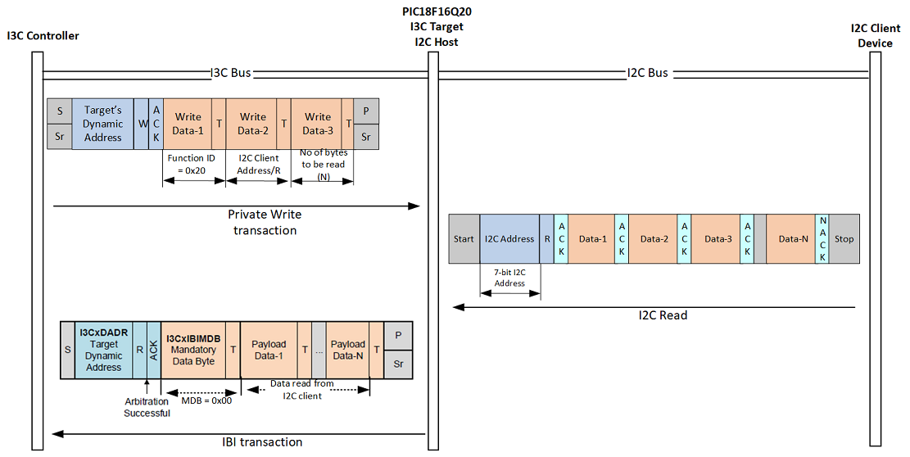
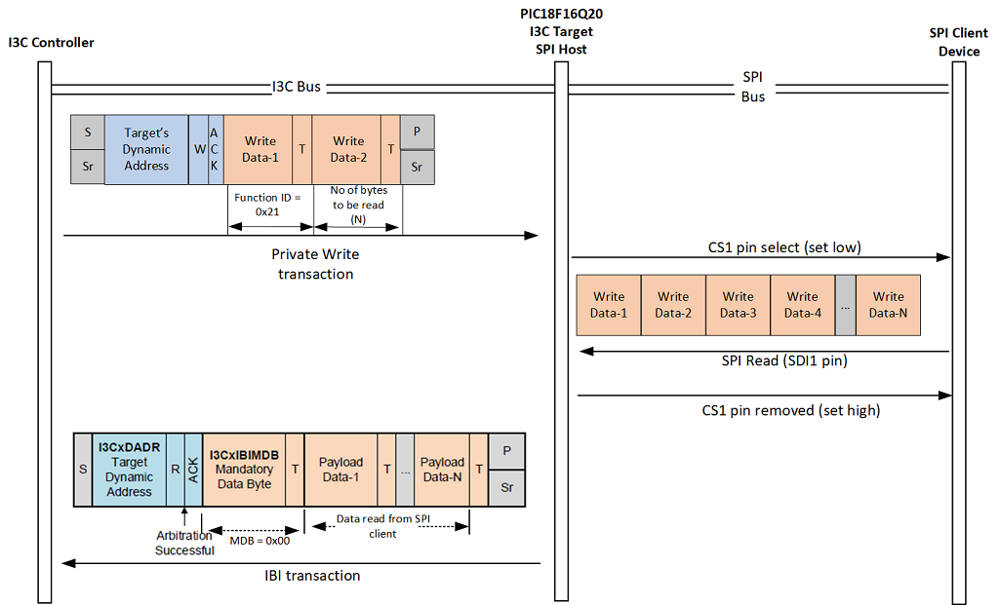
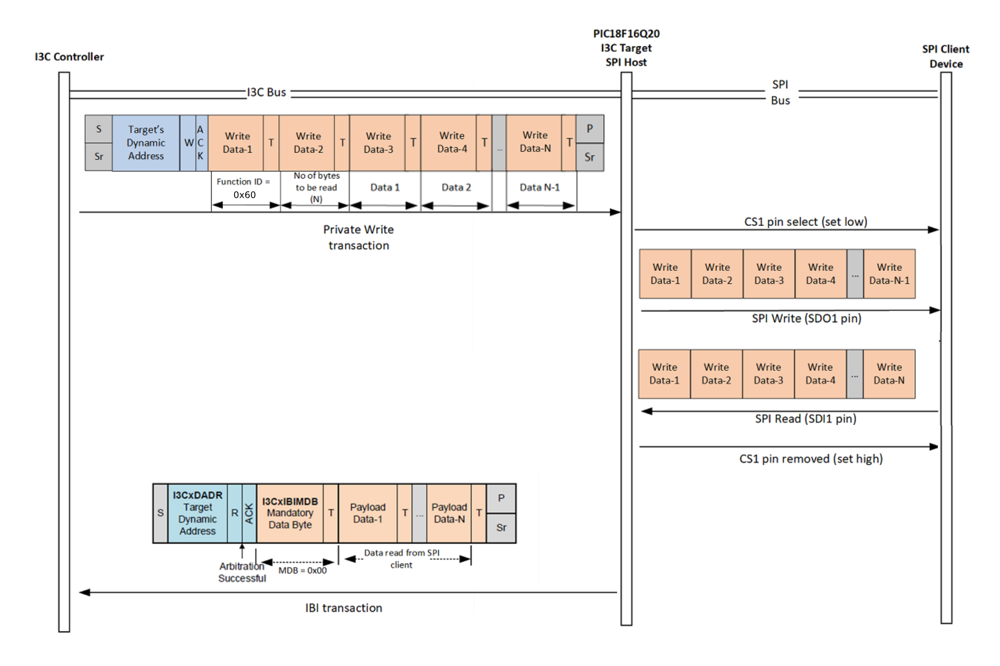

# Demo Supernova with PIC18F16Q20 board

This folder contains a demonstration project for interfacing with the PIC18F16Q20 board using the Supernova host adapter connected to the I3C High Voltage bus. The objective of this project is to utilize a modification of the [PIC18QF16Q20 as a protocol translator](https://mplab-discover.microchip.com/com.microchip.mcu8.mplabx.project.pic18f16q20-i3c-multi-protocol-translator-mplab-mcc) image for the PIC18F16Q20, issuing custom I3C commands to execute the following transactions:

- I2C write


- I2C read



- SPI write


- SPI read



- SPI write followed by read



## Prerequisites

- Python >= 3.8
- BinhoSupernova SDK == v4.0.0
- Supernova host adapter running `firmware version >= 4.0.0`
- Microchip PIC18F16Q20 Curiosity Nano board loaded with the custom image found in the _"PIC18F16Q20 firmware image"_ folder.
- Microchip PIC18F16Q20 Curiosity Nano board plugged on the Binho PIC18F16Q20 Curiosity Nano baseboard.
- Binho PIC18F16Q20 Curiosity Nano baseboard connected to the Supernova I3C HV Port through the I3C2-1.2V connector.
- External I2C F-RAM connected to the I2C bus from the Binho PIC18QF16Q20 Curiosity Nano baseboard through the I2C-I3C1 connector.

## Installation

1. **Install Dependencies:**

   Use the provided `requirements.txt` to install the necessary Python packages.

   ```bash
   pip install -r requirements.txt
   ```

## Usage

Follow the instructions on the PIC18QF16Q20-I3C-to-SPI-I2C-translator notebook.
