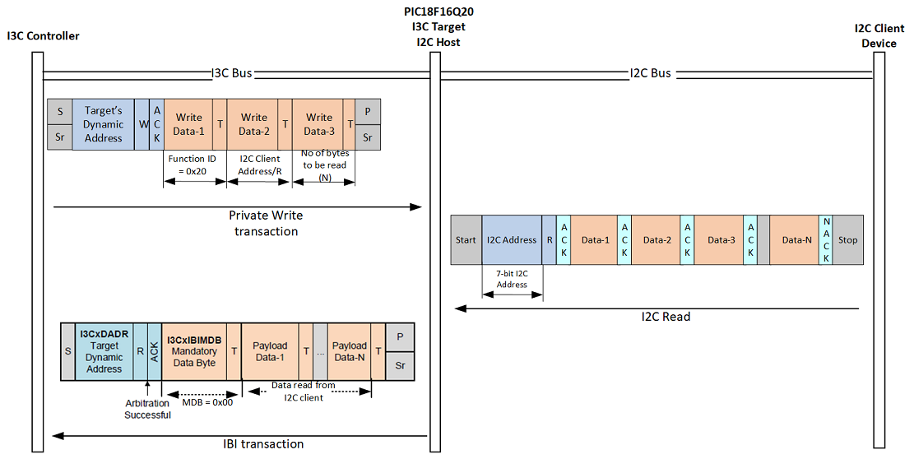
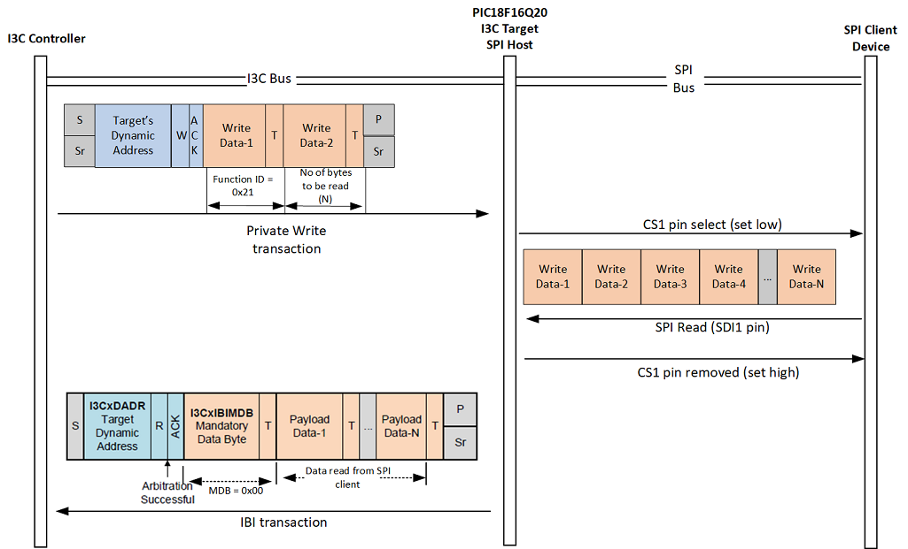

# Demo Supernova with PIC18F16Q20 board

This folder contains a demonstration project for interfacing with the PIC18F16Q20 board using the Supernova host adapter connected to the I3C High Voltage bus. The objective of this project is to utilize the PIC18QF16Q20 as a protocol translator, issuing custom I3C commands to execute the following transactions:

- I2C write


- I2C read



- SPI write


- SPI read



- SPI write followed by read


## Prerequisites

- Python 3.10
- Supernova host adapter
- PIC18QF16Q20 connected to the PIC18QF16Q20 board.
- PIC18QF16Q20 board connected to the high voltage I3C bus.
- External I2C F-RAM connected to the I2C bus from the PIC18QF16Q20 board.

## Installation

1. **Install Dependencies:**

   Use the provided `requirements.txt` to install the necessary Python packages.

   ```bash
   pip install -r requirements.txt
   ```

## Usage

Follow the instructions on the PIC18QF16Q20-I3C-to-SPI-I2C-translator notebook.
